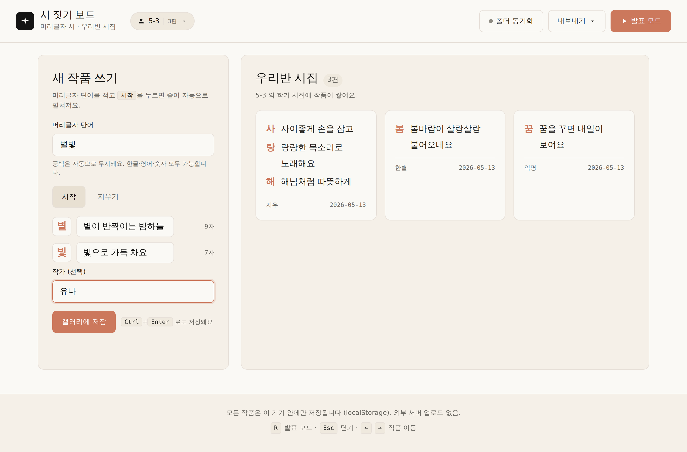

# 시 짓기 보드 · 머리글자 시 / 학기 시집

> **Day 02 / 100** · `100-Day Vibe Coding Kit` · 토픽 #002 (국어)

머리글자(아크로스틱) 단어를 받아 줄마다 한 문장씩 시를 완성하는 초등 국어 수업용 보드. 학기 동안 작품이 쌓이면 자동으로 **우리반 시집(PDF)** 으로 묶이고, 발표 시에는 무작위로 한 명의 작품을 풀스크린에 띄울 수 있습니다.



## 🌱 핵심 기능

- **학급 워크스페이스** — 첫 진입 시 학급 이름(예: `5-3`)을 등록하면 그 학급만의 시집이 시작됩니다. 한 선생님이 여러 학급(`5-3`, `6-1` 등)을 가르치는 경우 학급을 추가하면 갤러리가 학급별로 완전히 분리됩니다. 학급 전환은 헤더 칩 클릭 → 학급 관리 모달.
- **머리글자 자동 분해** — 단어를 입력하고 `시작`을 누르면 글자 수만큼 줄 입력 칸이 펼쳐집니다. 한글·영어·숫자 모두 가능하고 공백은 자동 무시.
- **글자 카운터** — 각 줄마다 실시간 글자 수 표시.
- **갤러리 (localStorage, 학급별)** — 저장한 작품이 카드로 누적. 새로고침 후에도 그대로. 학급마다 별도의 갤러리.
- **발표 모드** — 풀스크린으로 한 작품씩, 좌·우 화살표로 이동, `Esc`로 종료. `🎲 무작위로` 로 랜덤 작품 룰렛. 활성 학급 안에서만 도는 룰렛.
- **학기 시집 PDF** — 표지 → 차례 → 작품 N편 → 발문 순서로 묶인 단일 PDF 다운로드. 표지 학급명은 활성 학급명으로 자동 채워짐.
- **카드 PNG 저장** — html2canvas 로 카드 한 장씩 이미지 출력 (인쇄·전시용).
- **JSON 가져오기/내보내기** — 활성 학급의 작품만 백업·복원. 다른 학급으로 옮기려면 학급을 먼저 전환.
- **폴더 동기화 (선택)** — File System Access API 지원 브라우저(Chromium 계열)에서 폴더 한번 지정하면 학급별 `gallery-{학급명}.json` 자동 미러링.

## ⛔ 의도적으로 **배제한** 기능

- 학생 작품 서버 업로드 / 외부 공유 링크 — 모든 저장은 클라이언트 측 단독.
- AI 자동 작시 / 추천 문장 — 수업 의도와 정면 충돌 (학생 본인의 창작이 핵심).
- 검열·필터링 모델 / 욕설 자동 차단 — 교사 재량의 영역.
- 로그인·학생 식별 정보 수집.

## 🛠 실행 방법

### 온라인 (GitHub Pages)
배포 URL: <https://989-alt.github.io/project-02-sijitgi-bodeu/>

### 로컬
```bash
# 1) clone
git clone https://github.com/989-alt/project-02-sijitgi-bodeu.git
cd project-02-sijitgi-bodeu

# 2) 정적 파일이라 서버만 띄우면 됨
python3 -m http.server 5180 --bind 127.0.0.1
# → http://127.0.0.1:5180 접속
```

> `file://` 로 열어도 핵심 기능은 동작하지만, 일부 브라우저는 ES module 로드를 막으니 정적 서버 사용을 권장합니다.

### 테스트
```bash
pip install playwright
python3 -m playwright install chromium
# 별도 터미널: python3 -m http.server 5181 --bind 127.0.0.1
BASE_URL=http://127.0.0.1:5181 python3 tests/e2e.py
# → 6 / 6 passed  (학급 분리 / 마이그레이션 / 키보드 / 저장·복원 / 빈 상태 / 환영 모달)
```

## ⌨️ 단축키

| 키 | 동작 |
|---|---|
| 머리글자 칸에서 `Enter` | 줄 입력 펼치기 |
| 줄 입력 칸에서 `Ctrl/Cmd + Enter` | 갤러리에 저장 |
| `R` | 발표 모드 (무작위 작품) |
| 발표 모드: `←` `→` | 이전 / 다음 작품 |
| 발표 모드: `Space` | 다음 작품 |
| 발표 모드: `Esc` | 닫기 |

## 🎨 디자인

- **DESIGN.md**: `claude` (warm editorial) — [awesome-design-md](https://github.com/awesome-design-md) 컬렉션.
- **타이포 페어링**: `Noto Serif KR` (헤드라인·시 본문) + `Noto Sans KR` (UI 레이블).
- **색 토큰**: 크림 캔버스(`#faf9f5`) + 코랄 강조(`#cc785c`). 본문 대비 11.5:1, CTA 대비 4.6:1 (WCAG AA 통과).
- 모든 인터랙티브 요소에 `focus-visible` 윤곽, 모달은 `role="dialog" aria-modal="true"`.

## 🔒 개인정보

작품은 **이 기기 안에서만** 저장됩니다. 외부 서버 업로드, 분석 스크립트, 트래커 모두 없음. 인쇄·공유는 학생/교사 본인의 의지로 PDF·PNG·JSON 을 직접 내보낼 때만 발생합니다.

## 🏗 적용한 skill

- `brainstorming/SKILL.md` — MUST / SHOULD / MUST NOT 기능 분류
- `ui-ux-pro-max/SKILL.md` — design tokens · 접근성 · 페어링 결정
- `senior-devops/SKILL.md` — 품질·구조 원칙만 (CI/CD 부분은 무시)
- `webapp-testing/SKILL.md` + `with_server.py` + Playwright — 4개 E2E 시나리오 자동 검증

## 📦 파일 구조

```
.
├── index.html       # 단일 페이지 마크업
├── styles.css       # Claude design tokens 기반 vanilla CSS
├── app.js           # ES module — 입력·저장·발표·PDF·JSON
├── screenshot.png   # README 미리보기
├── docs/plans/      # 단계별 기획·브레인스토밍·UI/UX·버그·수정 로그
└── tests/
    ├── e2e.py       # Playwright E2E 4 시나리오
    └── hero_shot.py # README 스크린샷 생성기
```

## 🪪 라이선스

MIT — 자유롭게 가져다 쓰세요. 학교·교실 자체 변형을 환영합니다.

---

🤖 Generated end-to-end by an unattended agent loop as part of the `1-day-1-code-project` challenge. Day 1 = 2026-05-13.
